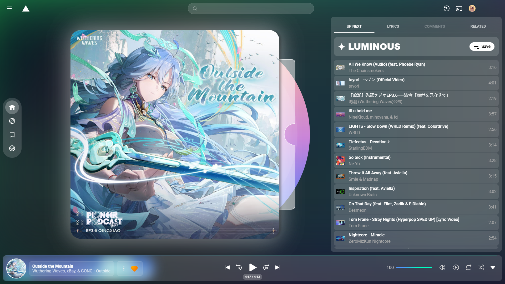
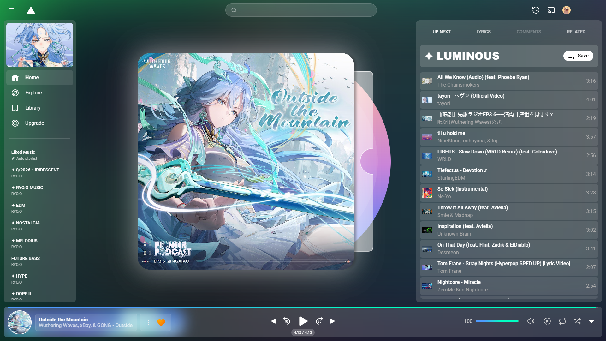
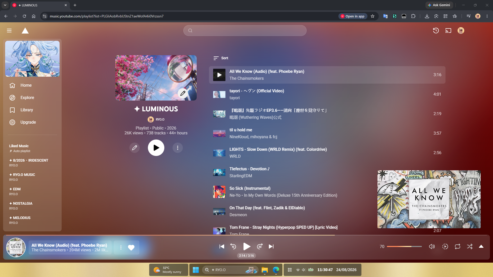
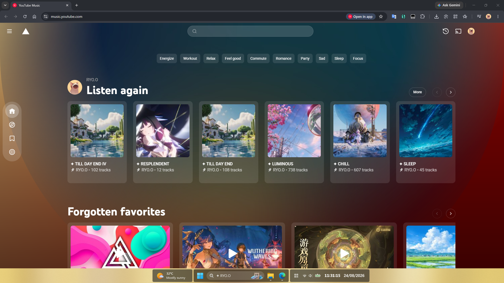

<table>
  <tr>
    <td width="50%"></td>
    <td width="50%"></td>
  </tr>
  <tr>
    <td width="50%"></td>
    <td width="50%"></td>
  </tr>
</table>

# ✦ This is the official style maintained by [ryokr](https://github.com/ryokr)
# ✦ Features :3

* Onboarding.
* Frost glass UI design.
* Customizable `logo` and `player page background` via the Stylus UI.
* Customizable `sidebar banner`, usage `url('your_image_url')`.
* Customizable `player progress bar` via the Stylus UI.
* `Enlarged`, `always-visible` volume bar with the current value displayed.
* Added `History`, `Playback Speed Control`, `Rewind 10s` and `Forward 30s` button.
* Improved visuals for the search bar and playlist panel.
* Toggleable vinyl-style thumbnail player animation via the Stylus UI.
* Optimized the bottom control layout for a more immersive experience.
* The save-playlist bar remains `pinned at the top`.
* Much more with daily future... Give it a try :3

# ✦ Installation
You have to install [Stylus](https://add0n.com/stylus.html) and then click on the install link below.

# ✦ Contributing
If you have any feature requests, feel free to open an issue.

# ✦ License
Code released under the [[license][MIT]] license.
